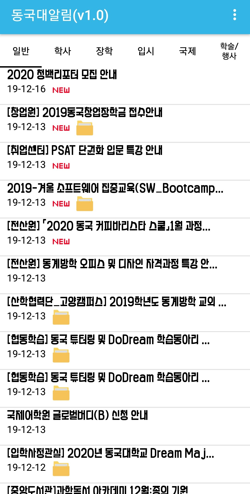
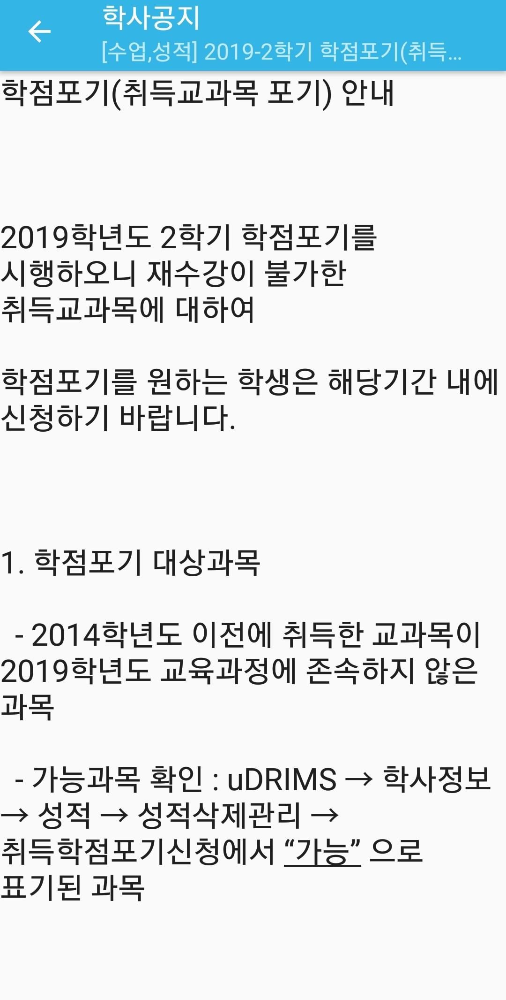
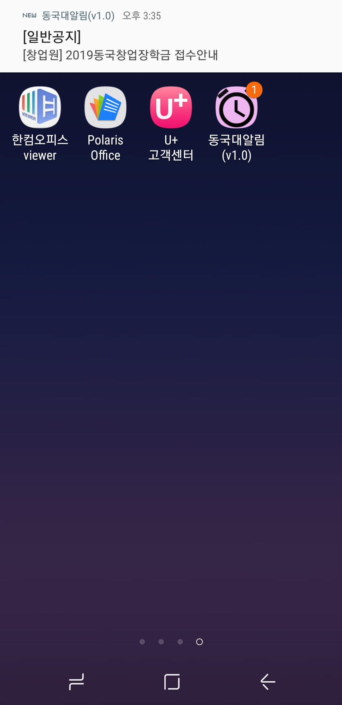
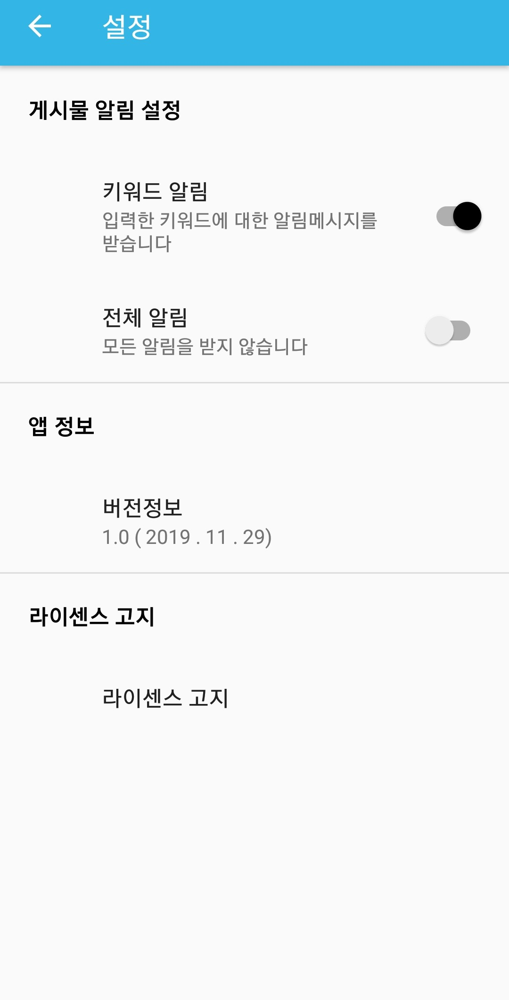

# 동국대 알람 어플

## version
1.0

## screenshot

## license

This application is Copyright  2019, 너만알람. All rights reserved.

The following sets forth attribution notices for third party software that may be contained in this application.

If you have any questions or concerns, please contact us at kmss69052@naver.com or rlawndud1104@naver.com

## open sourse

"\n\n\n\n1.okhttp\n" +
                "https://github.com/square/okhttp\n" +
                "Copyright 2019 Square, Inc.\n" +
                "Apache License 2.0\n" +
                "\n" +
                "\n" +
                "\n" +
                "2.retrofit2\n" +
                "https://github.com/square/retrofit\n" +
                "Copyright 2013 Square, Inc.\n" +
                "Apache License 2.0\n" +
                "\n" +
                "\n" +
                "3.glideview\n" +
                "https://github.com/bumptech/glide\n" +
                "Copyright 2014 Google, Inc. All rights reserved.\n" +
                "BSD, part MIT and Apache 2.0.\n" +
                "\n" +
                "\n" +
                "5.html-textview\n" +
                "https://github.com/SufficientlySecure/html-textview\n" +
                "Apache License 2.0\n" +
                "\n" +
                "\n" +
                "6.jsoup\n" +
                "https://github.com/jhy/jsoup\n" +
                "Copyright (c) 2009-2019 Jonathan Hedley <jonathan@hedley.net>\n" +
                "MIT license\n" +
                "\n" +
                "\n" +
                " Apache License 2.0\n" +
                "https://www.apache.org/licenses/LICENSE-2.0\n" +
                "\n" +
                "\n" +
                " MIT License 2.0\n" +
                "https://opensource.org/licenses/MIT\n" +
                "\n" +
                "\n" +
                " BSD\n" +
                "https://opensource.org/licenses/BSD-3-Clause\n" +
                "\"/>"dud1104@naver.com" +

